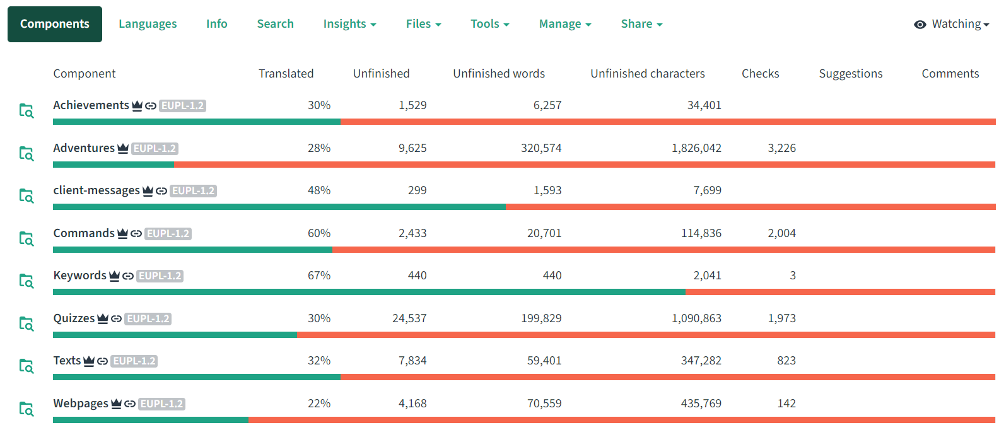
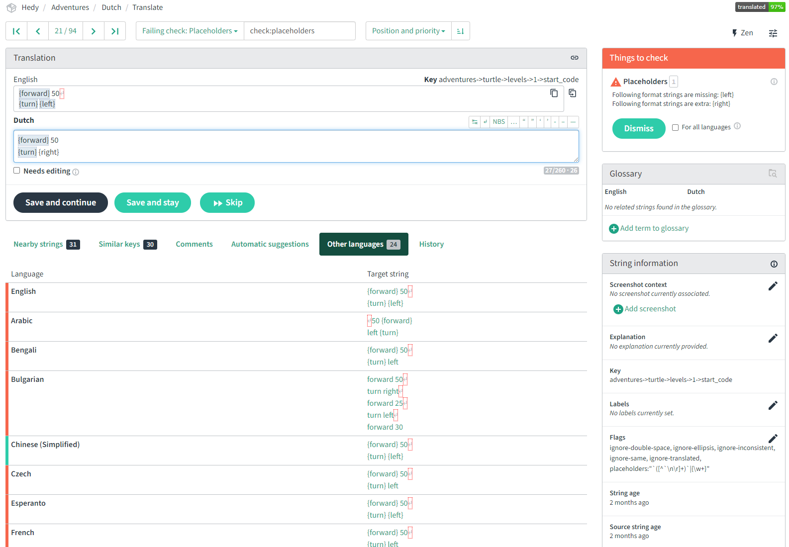

Translating Hedy
================

Hedy is now (partly) available in العربية, বাংলা, Български, Čeština, Deutsch, Ελληνικά, English, Español, Esperanto, Français, Frysk, हिन्दी, Indonesia, Italiano, Kiswahili, Magyar, 中文 (简体), Nederlands, Norsk Bokmål, فارسی, Polski, Português (Brasil and Portugal), Русский and Türkçe; but we'd love to support more languages and complete the ones we have!

Text that is not yet translated will be shown in English.

Help Hedy with translations (easy, no programming needed!)
----------------------------------------------------------

The easiest way to translate Hedy is by using the translation website of Weblate. You can find it [here](https://hosted.weblate.org/projects/hedy).

The first time you'll land on this page:

You see many projects you can support by translating, one of them is Hedy. You see a lock behind it's name, when you see this, Hedy (or a part of it) is locked for maintenance and translation is (partly) prohibited. We'll try to prevent this as much as possible.
Click on Hedy to start with this project.

Now you'll see the different component within Hedy you can work on:

On this page you see the progress of every component, calculated over all languages. At the time of this screenshot level-defaults was translated for 61% over 19 languages.

Click on "Languages" in the menu on top to get to this screen:

Here you can see the progress of languages, calculated over all components. There are a few reasons why a translation is not complete. First of course, because texts are not yet translated. But on this screen you can see more reasons. Often, the 100% is nog reached because of checks that failed. This tool checks many things, like "are question marks copied to the translation". The checks make translations better. You as a translator can dismiss any of these checks per text if you're sure it does not apply.

Now click on Dutch to reach the following screen:

The components are shown again, but now with progress shown calculated for only Dutch. If you actually want to translate files for us, you have to register with Weblate.

Now, lets start looking at texts to translate.

Click on Adventures to reach this screen:

Now you see an overview of this component. Little too much information maybe. Don't worry, just start with "Strings marked for edit". These are strings that have the English text in place of the translation or have been translated, but the source has changed. All texts start with the English source text, this way every text that has not been translated yet, is at least visible in English on the website.

If you're a little more expericend, you might want to try some of the texts that have specific checks failing.
At the right, you can choose between Translate or Zen.

If you choose for Translate for the Failing checks: Placeholders, you might see something like this:

Again, maybe a little too much information, but a lot is very helpful. Browse a little through this info. There is info about texts in the vicinity, or suggestions of computer translations. If you think this is too much info for now, you can choose for the Zen option which looks like this:

You see more strings on the same page for faster translation, but less helpfull info per translation.

One important thing to notice is the **grayed pieces of tekst**. This is computer code and should not be translated! There are two versions: keywords between {}, this is in real code that we need to be able to run. Translating these wil make our software fail. The other version is also between {}, but with extra `` around them. This is to highlight this code within text. It wil not make our software fail, but will make the program harder to use. So both of these should be handled with care.

That's all for now, any problems, let us know so we can address them here for future translators. You can reach us at [hedy@felienne.com](mailto:hedy@felienne.com).
